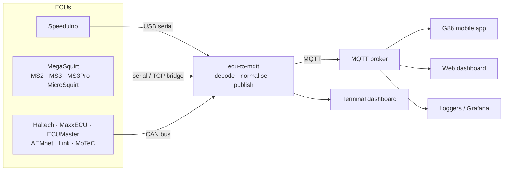
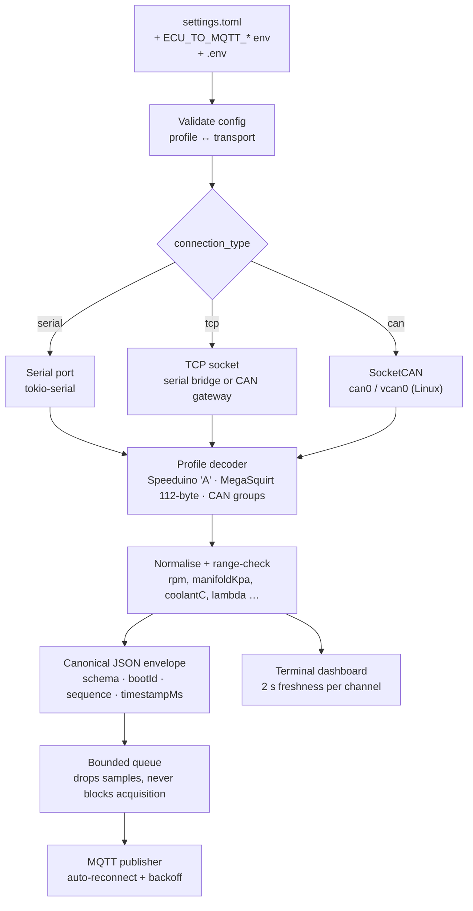
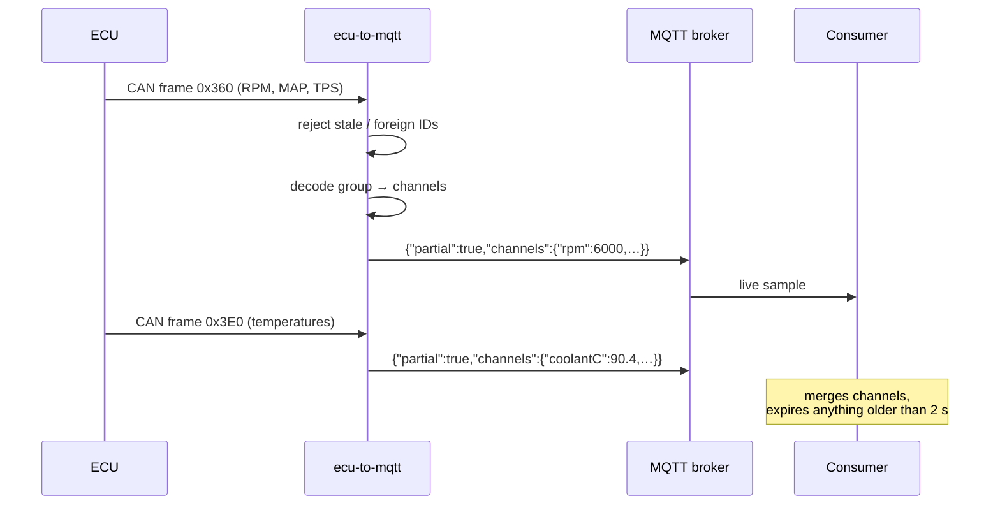
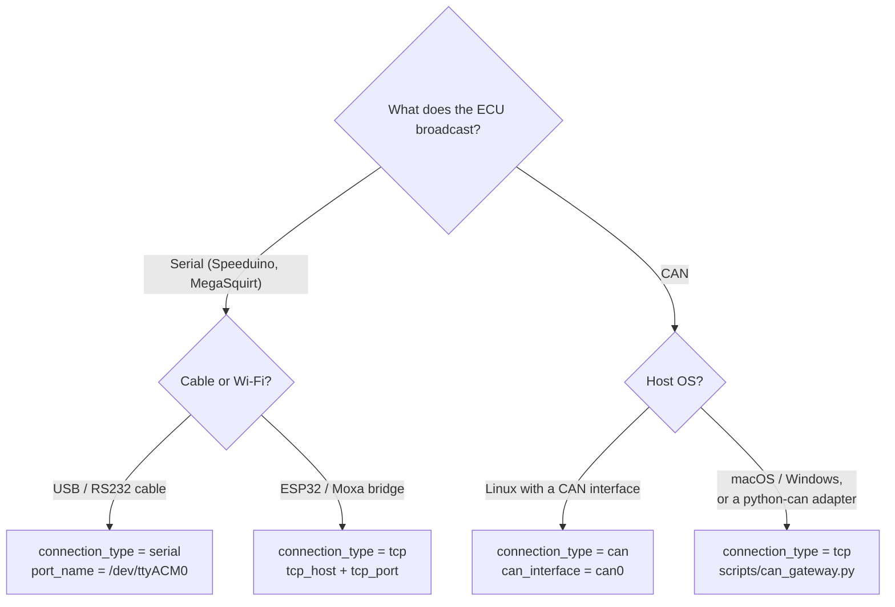

# ECU-to-MQTT

Read-only engine telemetry bridge: it reads a running ECU over serial, TCP or
CAN, decodes the manufacturer's broadcast into named channels, and publishes
them to an MQTT broker — with a live terminal dashboard for whichever ECU you
configured.

**Version 0.5.0** — renamed from `speeduino-to-mqtt`, now covering 15 ECU
profiles and native SocketCAN input. See
[What changed in 0.5.0](#what-changed-in-050) before upgrading, and
[ECU_PROTOCOLS.md](ECU_PROTOCOLS.md) for exact firmware boundaries and channel
lists. Non-Speeduino profiles are built from published specifications and
covered by automated protocol tests; on-car validation against each
manufacturer's own software is still outstanding.



Nothing is ever written to the ECU: no tuning, no map access, no CAN transmit.

---

## Supported ECUs

| `ecu_protocol` | ECU / required broadcast | Transport | Example config |
|---|---|---|---|
| `speeduino` | Speeduino primary `A` output (default) | serial / TCP | [speeduino.toml](examples/speeduino.toml), [speeduino-tcp.toml](examples/speeduino-tcp.toml) |
| `ms2` | MegaSquirt MS2/Extra 3.3+ | serial / TCP | [megasquirt-ms2-serial.toml](examples/megasquirt-ms2-serial.toml) |
| `ms3` | MegaSquirt MS3 1.2+ | serial / TCP | [megasquirt-ms3-serial.toml](examples/megasquirt-ms3-serial.toml) |
| `ms3_pro` | MS3Pro (MS3 compatibility command) | serial / TCP | [megasquirt-ms3pro-serial.toml](examples/megasquirt-ms3pro-serial.toml) |
| `microsquirt` | MicroSquirt on MS2/Extra firmware | serial / TCP | [microsquirt-serial.toml](examples/microsquirt-serial.toml) |
| `megasquirt_can_dash` | MegaSquirt dash broadcast | CAN | [megasquirt-can-dash.toml](examples/megasquirt-can-dash.toml), [socketcan](examples/megasquirt-can-dash-socketcan.toml) |
| `megasquirt_can_realtime` | MegaSquirt realtime broadcast, groups 0–3 | CAN | [megasquirt-can-realtime.toml](examples/megasquirt-can-realtime.toml) |
| `haltech_can_v2` | Haltech V2 (Elite / Nexus) | CAN | [haltech-can-v2.toml](examples/haltech-can-v2.toml), [socketcan](examples/haltech-can-v2-socketcan.toml) |
| `maxxecu_can_v12` | MaxxECU default CAN 1.2 | CAN | [maxxecu-can-v12.toml](examples/maxxecu-can-v12.toml) |
| `maxxecu_can_v13` | MaxxECU default CAN 1.3 | CAN | [maxxecu-can-v13.toml](examples/maxxecu-can-v13.toml) |
| `ecumaster_emu_can` | ECUMaster EMU PRO / EMU Black | CAN | [ecumaster-emu-can.toml](examples/ecumaster-emu-can.toml) |
| `aemnet_can` | AEMnet v150609 (29-bit extended) | CAN | [aemnet-can.toml](examples/aemnet-can.toml) |
| `link_generic_dash` | Link / Vi-PEC Generic Dash | CAN | [link-generic-dash.toml](examples/link-generic-dash.toml) |
| `link_generic_dash2` | Link Generic Dash 2 / Dash2Pro | CAN | [link-generic-dash2.toml](examples/link-generic-dash2.toml) |
| `motec_m1_pdm` | MoTeC M1 GPx 1.4 PDM output | CAN | [motec-m1-pdm.toml](examples/motec-m1-pdm.toml) |

Pick the **broadcast the ECU is configured to send**, not just the brand: Link
Generic Dash and Generic Dash 2 use different scaling, and MegaSquirt's dash and
realtime streams have different layouts.

---

## How it works



Each decoded packet updates **only the channels it carries**. A slow temperature
frame never refreshes a stopped RPM stream — stale channels are dimmed in the
dashboard and expire on the consumer side after two seconds.



---

## Choosing a connection



| Transport | `connection_type` | Needs | Notes |
|---|---|---|---|
| Hardware serial | `serial` | `port_name`, `baud_rate` | Speeduino and MegaSquirt profiles |
| TCP serial bridge | `tcp` | `tcp_host`, `tcp_port` | ESP32, Moxa, USR-VIS410 … |
| Native CAN | `can` | `can_interface` | Linux SocketCAN; lowest latency, no helper process |
| CAN gateway | `tcp` | `tcp_host`, `tcp_port` | `scripts/can_gateway.py`; any python-can adapter, any OS |

### Native CAN (Linux)

Bring the interface up with the bitrate the ECU uses, then point the bridge at
it. Interface setup is privileged and deliberately left outside this program.

```bash
# Real adapter (Haltech V2 runs at 1 Mbit/s; MaxxECU/MegaSquirt usually 500 kbit/s)
sudo ip link set can0 up type can bitrate 1000000

# Or a virtual bus for testing
sudo modprobe vcan
sudo ip link add dev vcan0 type vcan && sudo ip link set up vcan0

ecu-to-mqtt --config examples/haltech-can-v2-socketcan.toml
```

Frames carry kernel receive timestamps, so a frame that sat in the socket queue
is recognised as stale instead of being republished as live data. Error, remote
and CAN FD frames are ignored, and the socket is never written to.

For a systemd unit, add `AmbientCapabilities=` only if your adapter needs it —
reading an already-up interface requires no extra privileges.

### CAN gateway (any OS)

```bash
python3 -m venv .venv
.venv/bin/python -m pip install -r scripts/can-requirements.txt
.venv/bin/python scripts/can_gateway.py --interface socketcan --channel can0 --bitrate 1000000
# then, in another terminal
ecu-to-mqtt --config examples/haltech-can-v2.toml
```

The gateway forwards newline-delimited JSON frames on `127.0.0.1:29536` and
supports every python-can backend (SocketCAN, PCAN, Kvaser, SLCAN …). It has no
authentication — keep it on loopback or inside an authenticated tunnel.

---

## Install

### Packages

```bash
# Debian / Ubuntu
curl -fsSL https://g86racing.com/packages/apt/gpg.key | sudo gpg --dearmor \
     -o /usr/share/keyrings/g86racing-archive-keyring.gpg
echo "deb [signed-by=/usr/share/keyrings/g86racing-archive-keyring.gpg] \
     https://g86racing.com/packages/apt stable main" \
  | sudo tee /etc/apt/sources.list.d/g86racing.list
sudo apt update && sudo apt install ecu-to-mqtt

# Fedora / RHEL / Rocky
sudo dnf install ecu-to-mqtt

# macOS
brew tap askrejans/g86racing && brew install ecu-to-mqtt
```

Then configure and start the service:

```bash
sudo cp /etc/ecu-to-mqtt/settings.toml.example /etc/ecu-to-mqtt/settings.toml
sudo $EDITOR /etc/ecu-to-mqtt/settings.toml
sudo systemctl start ecu-to-mqtt
```

On Windows, download the release `.zip`, copy `settings.toml.example` to
`settings.toml`, and either run `ecu-to-mqtt.exe --config settings.toml` or
install it as a service with [NSSM](https://nssm.cc):

```powershell
nssm install ecu-to-mqtt "C:\ecu-to-mqtt\ecu-to-mqtt.exe"
nssm set    ecu-to-mqtt AppParameters "--config C:\ecu-to-mqtt\settings.toml"
nssm start  ecu-to-mqtt
```

### Docker

```bash
git clone https://github.com/askrejans/ecu-to-mqtt && cd ecu-to-mqtt
$EDITOR docker-compose.yml     # set profile, connection and broker
docker compose up -d && docker compose logs -f
```

Everything is configured through `ECU_TO_MQTT_*` environment variables, or by
mounting your own file over `/etc/ecu-to-mqtt/settings.toml`. Pass the serial
device with `devices:`, or `network_mode: host` when reading a CAN gateway on
the host. Native SocketCAN inside a container additionally needs
`network_mode: host` and `cap_add: [NET_ADMIN]`.

### From source

```bash
cargo build --release
cp example.settings.toml settings.toml && $EDITOR settings.toml
./target/release/ecu-to-mqtt                      # TUI when attached to a terminal
./target/release/ecu-to-mqtt --config examples/haltech-can-v2.toml
./target/release/ecu-to-mqtt --help               # options + all profile names
```

---

## Configuration

Settings come from (highest priority first) `ECU_TO_MQTT_*` environment
variables, `--config <file>`, then `./settings.toml`, `./ecu-to-mqtt.toml`,
the executable's directory and `/etc/ecu-to-mqtt/settings.toml`. A `.env` file
in the working directory is loaded automatically.

```toml
# ── ECU profile ─────────────────────────────────────────────────
ecu_protocol = "speeduino"   # see the supported-ECU table
# can_base_id = 0x360        # CAN profiles only; overrides the documented ID

# ── Connection ──────────────────────────────────────────────────
connection_type = "serial"   # "serial" | "tcp" | "can"
port_name  = "/dev/ttyACM0"  # serial
baud_rate  = 115200
# tcp_host = "192.168.1.100" # tcp: serial bridge or CAN gateway
# tcp_port = 23
# can_interface = "can0"     # can: Linux SocketCAN interface

# ── Speeduino packet handling ───────────────────────────────────
# expected_data_length = 130 # 119–256; 130 = simulator, 138 = current firmware
# read_timeout_ms      = 2000
refresh_rate_ms        = 20

# ── MQTT ────────────────────────────────────────────────────────
mqtt_enabled    = true       # false = decode and display only
mqtt_host       = "localhost"
mqtt_port       = 1883
mqtt_base_topic = "/ECU/"    # use a per-car prefix on a shared broker
# mqtt_username = ""
# mqtt_password = ""
# mqtt_use_tls  = false      # port 8883 for a remote broker
```

Every key has an environment equivalent: `ECU_TO_MQTT_ECU_PROTOCOL`,
`ECU_TO_MQTT_CONNECTION_TYPE`, `ECU_TO_MQTT_PORT_NAME`, `ECU_TO_MQTT_TCP_HOST`,
`ECU_TO_MQTT_TCP_PORT`, `ECU_TO_MQTT_CAN_INTERFACE`, `ECU_TO_MQTT_CAN_BASE_ID`
(decimal), `ECU_TO_MQTT_MQTT_HOST`, `ECU_TO_MQTT_MQTT_USERNAME`,
`ECU_TO_MQTT_MQTT_PASSWORD`, `ECU_TO_MQTT_LOG_LEVEL`, and
`ECU_TO_MQTT_NO_TUI=1` to force service/log mode. See
[example.settings.toml](example.settings.toml) for the fully commented file.

---

## MQTT output

Every profile publishes one canonical sample per decoded packet to
`<mqtt_base_topic>telemetry`:

```json
{"schema":1,"source":"haltech-can-v2","bootId":"1234-…","sequence":42,
 "timestampMs":1750000000000,"partial":true,
 "channels":{"rpm":6000,"manifoldKpa":101.3,"throttle":75.0}}
```

- `partial: true` — the sample updates only the listed channels.
- `bootId` changes on restart; `sequence` increases within a run.
- Units are in the names: `manifoldKpa` (absolute), `boostKpa` (gauge),
  `coolantC`, `batteryV`, `ignitionDeg`, `lambda`, `ecuSpeedKmh`, `lateralG` …
- Unsupported or implausible readings are omitted, never zero-filled.
- Messages are not retained; a full queue drops new samples rather than
  stalling ECU acquisition.

The Speeduino profile additionally publishes ~85 scalar topics such as
`/ECU/RPM`, `/ECU/CLT`, `/ECU/PW1`, `/ECU/CN01`. The full code list lives in
[ECU_PROTOCOLS.md](ECU_PROTOCOLS.md#speeduino-scalar-topics).

---

## Terminal dashboard

Run from a terminal and the bridge renders a live dashboard for the configured
profile — Speeduino gets its full parameter panel, every other profile gets the
canonical channels with per-channel freshness:

```text
┌──────────────────────────────────────────────────────────────────────┐
│ ECU-to-MQTT v0.5.0 │ Haltech CAN V2 │ press q to quit                 │
└──────────────────────────────────────────────────────────────────────┘
┌ CONNECTIONS ────────┐┌ ECU DATA ──────────────────────────────────────┐
│ PROTO: haltech_can_v2││ ── ENGINE ──                                   │
│                      ││ RPM  : 6000      TPS  : 75.0%   MAP : 101.3 kPa│
│ ECU:  ● ONLINE       ││ ── FUEL ──                                     │
│ CAN can0             ││ LAM  : 0.887     FUEP : 298.7 kPa              │
│ MQTT: ● ONLINE       ││ ── TEMPERATURES ──                             │
│ mqtt.local:1883      ││ CLT  : 90.4°C    IAT  : 31.2°C                 │
│ Msgs: 1284           ││ ── VEHICLE ──                                  │
│ Pkts: 1284           ││ SPD  : 112.5 km/h  GEAR : 3                    │
└──────────────────────┘└────────────────────────────────────────────────┘
┌ LOG (most recent) ───────────────────────────────────────────────────┐
│ INFO Listening on CAN interface                                      │
└──────────────────────────────────────────────────────────────────────┘
```

Under systemd, or with `ECU_TO_MQTT_NO_TUI=1`, the same data is written as
structured logs instead.

---

## What changed in 0.5.0

The rename is a clean break — there are no compatibility aliases:

| Item | Before | Now |
|---|---|---|
| Command / package | `speeduino-to-mqtt` | `ecu-to-mqtt` |
| systemd unit | `speeduino-to-mqtt.service` | `ecu-to-mqtt.service` |
| Config directory | `/etc/speeduino-to-mqtt/` | `/etc/ecu-to-mqtt/` |
| Environment prefix | `SPEEDUINO_…` | `ECU_TO_MQTT_…` |
| Default base topic | `/speeduino/ecu/` | `/ECU/` |
| Service account | `speeduino` | `ecu-to-mqtt` |
| MQTT client ID | `speeduino-to-mqtt-<pid>` | `ecu-to-mqtt-<pid>` |

Also new: native SocketCAN input (`connection_type = "can"`), a dashboard that
works for every profile, and a ready-made config per ECU in `examples/`.

Config keys, `ecu_protocol` values and the canonical JSON payload are unchanged,
so an existing `settings.toml` can be copied to the new directory as is. After
upgrading, remove the old package, unit and `speeduino` account, and update
broker ACLs or dashboards that referenced the old topic prefix or client ID.

---

## Development

```bash
cargo test                    # unit + integration tests
cargo clippy --all-targets    # warning-free
cargo fmt --check
python3 -m unittest discover -s scripts -p 'test_can_gateway.py'

# End-to-end: every profile through the compiled binary to a real broker
cargo build && python3 scripts/smoke_mqtt_bridge.py

# SocketCAN tests against a virtual bus (Linux)
sudo modprobe vcan && sudo ip link add dev vcan0 type vcan && sudo ip link set up vcan0
cargo test -- --ignored
```

CI runs all of the above plus a container build on every push
([.github/workflows/ci.yml](.github/workflows/ci.yml)).

### Releasing

Pushing a version tag builds every artifact and publishes a GitHub Release
([.github/workflows/release.yml](.github/workflows/release.yml)):

```bash
# Cargo.toml version and tag must match (a leading "v" is optional)
git tag 0.5.0 && git push origin 0.5.0
```

The workflow produces Linux `.deb`/`.rpm` (x86_64 + aarch64), macOS and Windows
archives, `SHA256SUMS`, and a multi-arch `ghcr.io/askrejans/ecu-to-mqtt` image.
To build packages locally instead:

```bash
./scripts/build_packages.sh                                  # everything
./scripts/build_packages.sh --platform linux --arch arm64 --type deb
./scripts/build_packages.sh --help
```

Each Linux package installs `/usr/bin/ecu-to-mqtt`, the
`ecu-to-mqtt.service` unit, an example config in `/etc/ecu-to-mqtt/`, and an
`ecu-to-mqtt` system account in the `dialout` and `tty` groups.

---

## Project layout

| Path | Contents |
|---|---|
| `src/config.rs` | Settings, validation, environment and file precedence |
| `src/connection.rs`, `src/ecu_serial_comms_handler.rs` | Serial/TCP transport, reconnection |
| `src/ecu_data_parser.rs` | Speeduino `A` packet parser and scalar topics |
| `src/ecu_protocol.rs`, `src/can_profiles.rs` | Profile registry, MegaSquirt serial and CAN decoders |
| `src/can_socket.rs`, `src/can_stream.rs`, `src/can_input.rs` | SocketCAN input, gateway input, shared frame handling |
| `src/telemetry_frame.rs`, `src/mqtt_handler.rs` | Canonical envelope, MQTT client and queue |
| `src/tui.rs` | Terminal dashboard |
| `examples/` | One ready-made config per ECU profile |
| `scripts/` | CAN gateway, packaging, end-to-end smoke test |

---

## Related projects

- [speeduino-serial-sim](https://github.com/askrejans/speeduino-serial-sim) — ECU simulator for testing without hardware
- [GPS-to-MQTT](https://github.com/askrejans/gps-to-mqtt) — companion GPS bridge
- [G86 Web Dashboard](https://github.com/askrejans/G86-web-dashboard) — web dashboard for MQTT telemetry

Licensed under the MIT licence — see [LICENCE](LICENCE).
